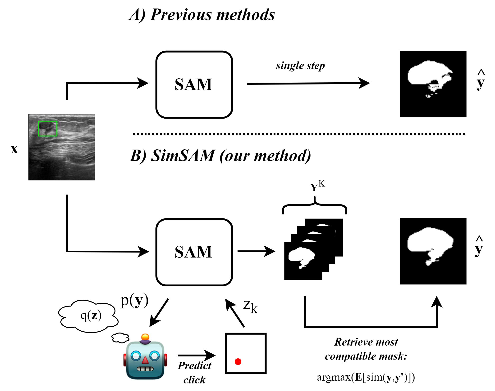

# SimSAM: Zero-shot Medical Image Segmentation via Simulated Interaction


Official code for the ISBI 2024 submission: *SimSAM: Zero-shot Medical Image Segmentation via Simulated Interaction*

## Requirements
* datasets
* monai
* numpy
* opencv-python
* tifffile
* torch
* transformers

The relevant packages can be installed with:
```shell
pip install -r requirements.txt
```
This repo also uses [surface-distance](https://github.com/google-deepmind/surface-distance/tree/master), which should be downloaded and included in the root folder.

## Downloading the datasets
This paper makes use of three datasets, which need to be separately downloaded.
- Breast Ultrasound Scans can be downloaded from [Kaggle](https://www.kaggle.com/datasets/aryashah2k/breast-ultrasound-images-dataset).
- CVC ClinicDB is available [here](https://polyp.grand-challenge.org/CVCClinicDB/).
- ISIC 2016 is available [here](https://challenge.isic-archive.com/data/#2016) (you should download Task 1).
Downloaded content should be placed in the `data/` folder.


## Evaluation
You can evaluate either the `baseline` or the `simsam` model with the `eval.py` script, by selecting from one of the following datasets: `["busi", "cvc", "isic"]`. For example:
```shell
python scripts/eval.py --model_load_path facebook/sam-vit-base \
    --dataset cvc \
    --model_type simsam \
```

## Training
You can also finetune the SAM model on any of the datasets with:
```shell
python scripts/train.py --model_load_path facebook/sam-vit-base \
    --model_save_path path/to/save/model \
    --dataset cvc \
    --learning_rate 1e-5 \
    --num_train_epochs 10 \
```
